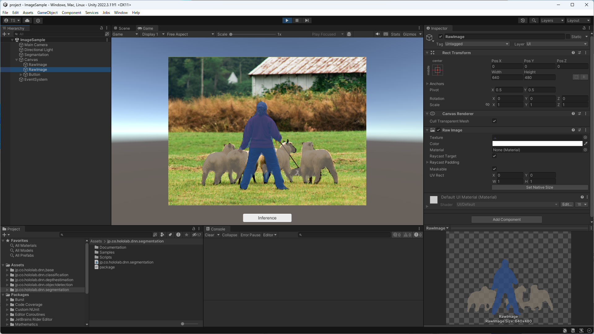

# HoloLab DNN Packages

## About

The HoloLab DNN Packages provides image recognition library using deep learning running on the Unity.  
This packages is implemented based on Unity Sentis.  

## Packages

The HoloLab DNN Packages consists of some packages.  
You can use this library by combination of one base package and some task packages.  
Please see README of each package about how to use package.  

### Base Package

* [jp.co.hololab.dnn.base](packages/jp.co.hololab.dnn.base/Documentation/README.md)  
  This package is provides base class for dnn inference.  
  This package is used as internal dependency for other packages.  
  You can create inference classes for your models using this base class too.  

### Task Packages

* [jp.co.hololab.dnn.classification](packages/jp.co.hololab.dnn.classification/Documentation/README.md)  
  This package is provides classification class using general classification models.  
  This package contains simple inference sample app to learn how to use classification class.  
    

* [jp.co.hololab.dnn.objectdetection](packages/jp.co.hololab.dnn.objectdetection/Documentation/README.md)  
  This package is provides object detection class using YOLOX model.  
  This package contains simple inference sample app to learn how to use object detection class.  
    

* [jp.co.hololab.dnn.depthestimation](packages/jp.co.hololab.dnn.depthestimation/Documentation/README.md)  
  This package is provides depth estimation class using general relative depth estimation models.  
  This package contains simple inference sample app to learn how to use depth estimation class.  
    

* [jp.co.hololab.dnn.segmentation](packages/jp.co.hololab.dnn.segmentation/Documentation/README.md)  
  This package is provides segmentation class using general segmentation models.  
  This package contains simple inference sample app to learn how to use segmentation class.  
    

## Environment

These packages works on Unity 2021.3 LTS or later.  

## License

Copyright &copy; 2024 [HoloLab Inc.](https://hololab.co.jp/)  
All packages are distributed under the MIT license for now.  
Please see the license for each packages.  
