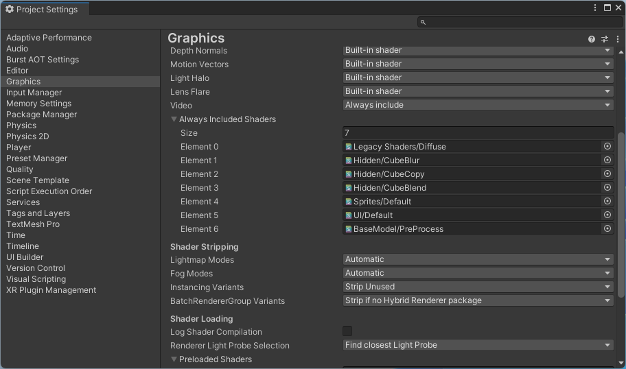

# README

## About

This package is providing object detection using YOLOX model and YOLOv9 MIT model.  
This object detection is implemented based on Sentis.  

## Environment

These packages work on Unity 2023.2 (Unity 6) or later.  

## License

Copyright &copy; 2024 [HoloLab Inc.](https://hololab.co.jp/)  
Distributed under the [MIT License](LICENSE).  

## Which Models Are Supported

The following models are expected to works.  
Please export trained weights to ONNX format.  

* ObjectDetectionModel_YOLOX class : [YOLOX](https://github.com/Megvii-BaseDetection/YOLOX)
* ObjectDetectionModel_YOLOv9 class : [YOLOv9 MIT](https://github.com/WongKinYiu/YOLO) <sup>*1</sup>

<sup>*1 Required to overwrite input layer shape to 1x3x640x640 using ONNX Simplifier. (e.g. onnxsim --overwrite-input-shape="1,3,640,640" ./v9-s.onnx ./yolov9_s.onnx)</sup>

## How To Add Package

Please add package in one of the following methods.  

* Package Manager

    1. [Window]>[Package Manager]
    2. [+]>[Add package from git URL...]
    3. Add the following URLs
        * ```https://github.com/HoloLabInc/HoloLabDnnPackages.git?path=packages/jp.co.hololab.dnn.base```
        * ```https://github.com/HoloLabInc/HoloLabDnnPackages.git?path=packages/jp.co.hololab.dnn.objectdetection```

* Packages/manifest.json

    1. Open Packages/manifest.json file using text editor
    2. Add the following lines in dependencies
        ```
        "jp.co.hololab.dnn.base": "https://github.com/HoloLabInc/HoloLabDnnPackages.git?path=packages/jp.co.hololab.dnn.base",
        "jp.co.hololab.dnn.objectdetection": "https://github.com/HoloLabInc/HoloLabDnnPackages.git?path=packages/jp.co.hololab.dnn.objectdetection",
        ```

## How To Use

Please see [samples](../Samples~).  

## How To Build

> [!NOTE]  
> This setting is automatically by editor extension when importing jp.co.hololab.dnn.base package.  

This package depends on BaseModel/PreProcess shader of jp.co.hololab.dnn.base.  
Please add BaseModel/PreProcess shader to Always Included Shaders before building your application.  

1. [Edit]>[Project Settings]
2. [Graphics]>[Always Included Shaders]
3. increment size and set BaseModel/PreProcess shader to new element


