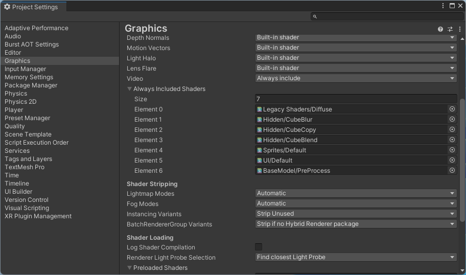

# README

## About

This package is providing segmentation using general segmentation models.  
This object detection is implemented based on Sentis.  

## Environment

These packages work on Unity 2021.3 LTS or later.  

## License

Copyright &copy; 2024 [HoloLab Inc.](https://hololab.co.jp/)  
Distributed under the [MIT License](LICENSE).  

## Which Models Are Supported

> [!NOTE]  
> SegmentationModel class supports general segmentation models with input shape is NCHW and output shape is 1 x num_classes x height x width.  

The following models are expected to works.  
Please export trained weights to ONNX format.  

* SegmentationModel class : General classification models such as [DeepLab v3](https://pytorch.org/vision/main/models/deeplabv3.html), and others.

## How To Add Package

Please add package in one of the following methods.  

* Package Manager

    1. [Window]>[Package Manager]
    2. [+]>[Add package from git URL...]
    3. Add the following URLs
        * ```https://github.com/HoloLabInc/HoloLabDnnPackages.git?path=packages/jp.co.hololab.dnn.base```
        * ```https://github.com/HoloLabInc/HoloLabDnnPackages.git?path=packages/jp.co.hololab.dnn.segmentation```

* Packages/manifest.json

    1. Open Packages/manifest.json file using text editor
    2. Add the following lines in dependencies
        ```
        "jp.co.hololab.dnn.base": "https://github.com/HoloLabInc/HoloLabDnnPackages.git?path=packages/jp.co.hololab.dnn.base",
        "jp.co.hololab.dnn.segmentation": "https://github.com/HoloLabInc/HoloLabDnnPackages.git?path=packages/jp.co.hololab.dnn.segmentation",
        ```

## How To Use

Please see [samples](../Samples~).  

## How To Build

> [!NOTE]  
> This setting is automatically by editor extension when importing jp.co.hololab.dnn.base package.  

This package depends on BaseModel/PreProcess shader of jp.co.hololab.dnn.base.  
Please add BaseModel/PreProcess shader to Always Included Shaders before building your application.  

1. [Edit]>[Project Settings]
2. [Graphics]>[Always Included Shaders]
3. increment size and set BaseModel/PreProcess shader to new element


